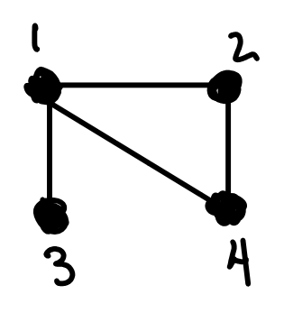

## Directions

This is a self-guided **group worksheet**.  Work with your group members to follow the instructions below and explore!  Note that some of the results will be assessed later, so make sure you do it right!

## Spectral Cluserting for Graphs

### The graph Laplacian

Let $$G$$ be a graph with $$n$$ vertices.
The **adjacency matrix** of the graph is the symmetric matrix $$A$$ whose $$j,k$$'th entry is given by

$$A_{jk} = \left\lbrace\begin{array}{cc}
1 & \text{vertices j and k are connected}\\
0 & \text{vertices j and k are not connected}
\end{array}\right.$$

The **degree matrix** $$D$$ is an $$n\times n$$ diagonal matrix whose diagonal entries are given by

$$D_{jj} = \text{degree of vertex j},$$

where the degree of a vertex is the number of edges touching the vertex.
The **graph Laplacian** is the difference of these two matrices

$$L = D-A.$$

For example, consider the graph

The adjacency matrix of this graph is given by

$$A = \left[\begin{array}{cccc}
0 & 1 & 1 & 1\\
1 & 0 & 0 & 1\\
1 & 0 & 0 & 0\\
1 & 1 & 0 & 0
\end{array}\right]$$

and the degree matrix is

$$D = \left[\begin{array}{cccc}
3 & 0 & 0 & 0\\
0 & 2 & 0 & 0\\
0 & 0 & 1 & 0\\
0 & 0 & 0 & 2\\
\end{array}\right]$$

The graph Laplacian is then

$$L = D-A = \left[\begin{array}{cccc}
3  & -1 & -1 & -1\\
-1 &  2 &  0 & -1\\
-1 &  0 &  1 &  0\\
-1 & -1 &  0 &  2
\end{array}\right]$$

## Clusters in graphs

In **spectral clustering** the eigenvalues and eigenvectors of the **graph Laplacian**

$$L = D - A$$

of a graph $$G$$ are used to find **clusters**, groups of vertices which are closely connected together, compared to the other vertices in the graph.
Here 

